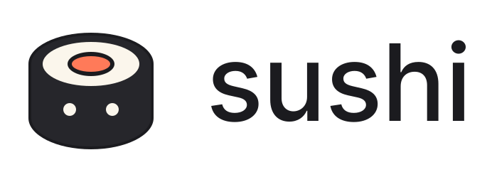

<p align="center">
  <picture>
    <source media="(prefers-color-scheme: dark)" srcset="assets/logo/horizontal-reversed.svg">
    
  </picture>
</p>

# Sushi

An animated pet that keeps an eye on your coding agents inspired by [coucou](https://github.com/Louis-CFM/coucou). It runs as a **desktop app on macOS, Windows
and Linux** (any desktop environment) and as a plugin for the [Noctalia](https://docs.noctalia.dev) shell (v5).
It watches **Claude Code**, **Codex CLI**, **GitHub Copilot CLI**, **Antigravity CLI**, **Gemini CLI**, **opencode** and **pi**, side by side.

- **Live**: every session, step by step. What the agent reads, edits and runs, as a rail of steps
  (✓ done, ◌ running, ✗ failed) and a viewer with the **diff of the file being edited** (line numbers,
  red/green lines, syntax colors, typed out as it happens), the terminal of a command (with how long it has
  been running), or the file it read. Steps come faster than you can read them, so the viewer lets each edit
  be typed out and each command be seen before moving on, skips the reads in between, and never falls more
  than three steps behind. When a turn finishes the pet does a happy little jump.
- **Search, flag, export**: the live rail only ever shows a session's last few steps, but a search
  box above it queries that session's full stored history (hundreds of steps, kept beyond the
  current turn and beyond the session ending — see `sushi::history`) by tool name, label, diff or
  command text. Any step, live or found by search, can be **flagged "needs review"** (with an
  optional note), which persists across restarts and shows up on the live rail too. The export
  button (or `sushi export SESSION_ID`) writes the session's steps as a markdown file — the same
  bounded diffs/output the viewer already shows, never a complete/git-applyable patch — to
  `~/.cache/sushi/exports/`, and prints/shows the resulting path.
- **Approve from the notch**: permission requests pop up with a preview of what the agent wants to do and
  **Allow / Deny** buttons. One click, back to work. With Claude Code, when it **asks you a question**
  (`AskUserQuestion`) its options show up as buttons and your choice goes straight back; a
  **plan** (`ExitPlanMode`) can be read and approved (with or without auto-accepted edits) or sent back
  with "Keep planning". When an agent waits in its own terminal with nothing to answer in the notch, the
  pet calls you all the same.
- **Ask anything**: a built-in chat tab that runs one of your agents headless with no tools (Claude Code, Copilot, pi or
  Codex, your choice in the plugin settings).
- **Feed it a file**: drop a file on the pet and it swallows it; the chat opens with the file attached, so the
  next question is about it. An audio file (wav, mp3, flac, ogg, m4a, aac, opus, wma) is transcribed first, with
  [whisper.cpp](https://github.com/ggml-org/whisper.cpp) running fully offline — set `transcribe_model_path` to a
  GGML/GGUF model to turn this on; the transcript is also kept next to the audio file as a `.txt`.
- **Usage**: plan limits for every agent that has them — Claude Code's 5-hour/weekly windows, Codex's same shape
  when logged in with a ChatGPT account, Copilot's monthly quotas and Antigravity's per-model windows, each
  fetched straight from that agent's own account, side by side — plus Claude's context window trend and a
  token/estimated-cost comparison across every agent ("not tracked yet" for the agents nothing reads transcripts
  for today, never a fabricated number), and a **day-by-day cost chart** (`usage_history`, persisted so it
  survives a restart, unlike the rest of `usage` which is rebuilt from transcripts). **Budget alerts**
  (`budget_alerts` in `config.json`) raise a one-shot pet reaction (a distinct sound and a worried blip) the
  moment a plan window or a daily token/cost budget crosses a configured threshold — `budget_alerts_by_cwd`
  adds the same check **per project** (keyed by a session's exact `cwd`), shown as its own row in the Usage
  tab, for when different repos have very different costs.
- **External hooks**: run a command and/or POST a small JSON body to a URL (`hooks` in `config.json`) when a
  session starts or ends, starts waiting for you, or a turn finishes — e.g. kick off a build, a staging deploy,
  or update an internal dashboard. Fire-and-forget: a slow or failing script never blocks the daemon.
- **Policy flags**: configured rules (`policies` in `config.json`) flag a matching tool call (e.g. a `Bash`
  command containing `rm -rf`) in the live viewer for every agent, even one it auto-approved. Real
  enforcement — genuinely forcing Claude Code to ask or refuse — uses its own native `permissions.ask` /
  `permissions.deny` instead (`claude_permissions` in `config.json`, merged in by `sushi install --agent claude
  --write`): see [Policy flags vs. real enforcement](#policy-flags-vs-real-enforcement) for why the other agents
  only get the flag, not the block.
- **Focus mode**: a quiet, compact pet (no sounds, no idle fidgets, but the status badge stays visible) during
  configured hours, or forced on/off with the moon button next to the pet's emotes (app only; the Noctalia
  plugin follows the configured schedule).
- **A pet with a personality**: 30 characters (nigiri, maki, ramen, bao, dango, sake, taiyaki, ramune…), breathing, blinking,
  eyes that glance at whatever you hover, 30+ emotes and idle quirks, a nap after a while, a greeting
  on launch and 31 little sounds. Each character also has its own temperament (energetic, calm, shy, fancy,
  sleepy, cozy, feisty, classic…): it fidgets more or less often, leans toward a few favorite quirks, and
  flavors a handful of lines ("Ha! Done!" for the feisty wasabi, "Finished, calmly." for the calm tofu).
- **Milestones with accessories**: if you leave it on, a quiet day-streak counter and a step-watched counter
  in the Usage tab, and the pet wears small permanent pins for the highest tier it has ever earned on each
  track (bronze → silver → gold → platinum → diamond) — a flame for the streak, an award for steps watched.
  They are earned badges, not a live gauge: breaking a streak does not take the pin away.

## Supported agents

| | Claude Code | Codex CLI | GitHub Copilot | Antigravity CLI | Gemini CLI | opencode | pi |
|---|:-:|:-:|:-:|:-:|:-:|:-:|:-:|
| Sessions, steps, diffs, command output | ✓ | ✓ | ✓ | ✓ | ✓ | ✓ | ✓ |
| Allow / Deny from the notch | ✓ | ✓ | ✓ | – | ✓ (unverified) | ✓ | opt-in (`SUSHI_PI_APPROVE=1`) |
| Questions and plans | ✓ | – | – | – | – | – | – |
| Context size and tokens | ✓ | – | – | – | – | – | – |
| Plan limits (5 h / weekly or monthly quota) | ✓ | ✓ (ChatGPT login) | ✓ (undocumented) | ✓ (unverified) | – | – | – |
| Built-in chat | ✓ | ✓ (read-only sandbox, not tool-free) | ✓ | – | – | – | ✓ |
| Connected through | hooks in `~/.claude/settings.json` | hooks in `~/.codex/hooks.json` | hook file `~/.copilot/hooks/sushi.json` | group in `~/.gemini/config/hooks.json` | hooks in `~/.gemini/settings.json` | plugin in `~/.config/opencode/plugins/` | extension in `~/.pi/agent/extensions/` |

Codex user-input questions are shown in the compact notch panel; answer them in the Codex app or CLI running the session. After updating Sushi, reconnect Codex (`sushi install --agent codex --write`) to add interruption tracking, then review and trust the new hook in Codex. Restart the Sushi daemon and desktop app to load the updated binaries.

What has been checked against the real thing:

- **Claude Code**: the reference.
- **GitHub Copilot CLI** (1.0.89): the hook payloads in `src/agent/copilot.rs` were recorded from the real CLI;
  Allow and Deny from the notch were run end to end (the allowed command ran, the denied one did not), and so
  was the chat. Copilot gives no id for tool calls, so a step is matched to its result by tool name.
- **Antigravity CLI** (`agy` 1.2.14): watched only. The hook payloads in `src/agent/antigravity.rs` were recorded
  from the real CLI, but a `PreToolUse` hook cannot approve: its `allow` does not skip Antigravity's own
  confirmation (tried interactively and headless; reported upstream as
  [#1053](https://github.com/google-antigravity/antigravity-cli/issues/1053)), so Allow / Deny from the notch is
  off. What Sushi does is flag the session as waiting while a command, a file write or a URL fetch runs, so the
  pet calls you to the `agy` terminal (it cannot tell whether `agy` will really ask: with a permission already
  granted the flag lasts a moment). On Linux the hook reports the `agy` process, so the session goes away
  when `agy` quits instead of waiting for hours. Its hook payloads carry no event name, so the event is told from the fields; the argument names of
  `view_file`, the replace tools and the searches come from its documentation. No chat.
- **pi**: the extension follows the docs shipped with pi 0.85 and was exercised against a stand-in for pi's API,
  not inside pi. The chat parser follows pi's JSON mode docs (the model configured here was offline).
- **Codex** (hooks and `codex exec --json` as documented; the `apply_patch` shape is a best reading of the docs),
  **opencode** (plugin API as documented) and **Gemini CLI** (hooks as documented in
  `docs/hooks/reference.md`; whether `BeforeTool`'s `"allow"` really skips its own confirmation
  prompt is unverified, unlike Antigravity's confirmed bug — see `src/agent/gemini.rs`) have only
  been tested against their documented payloads.

Plan limits (`src/limits/`) are a separate, undocumented-API-per-agent problem from the hook payloads above, so
their own confidence levels, from most to least certain:

- **Claude Code** (`limits/claude.rs`): Anthropic's own OAuth usage endpoint, the same one Claude Code itself
  calls — the reference, like everywhere else in this list.
- **Codex** (`limits/codex.rs`): verified by reading the open-source `codex-rs` client's own source
  (`backend-client/src/client.rs`, `client/rate_limit_resets.rs`, the `codex-backend-openapi-models` crate) for
  the endpoint and every field name, and cross-checked against `steipete/CodexBar`'s independent notes — but
  never run against a real ChatGPT-login account. Only works when logged in with a ChatGPT account, not an API
  key (which has no plan window at all).
- **GitHub Copilot** (`limits/copilot.rs`): GitHub documents none of this. The endpoint and field names come
  from cross-checking a public quota-tracking gist against `steipete/CodexBar`'s notes, not from anything
  GitHub ships. The bigger uncertainty is the token: Copilot CLI's own OAuth token usually lives in the OS
  keychain, not a file Sushi can read portably, so it is taken from (in order) `COPILOT_GITHUB_TOKEN` /
  `GH_TOKEN` / `GITHUB_TOKEN`, the `gh` CLI's `hosts.yml`, the macOS Keychain entry `copilot-cli`, and finally
  Copilot CLI's own plaintext fallback (`~/.copilot/config.json`, used when no keychain is available). If none
  of those holds a usable token, it is just unavailable.
- **Antigravity** (`limits/antigravity.rs`): the least certain of the four. Antigravity reuses Google's internal
  Cloud Code Assist backend, and everything here — endpoint, request body, field names, credentials file —
  comes from `steipete/CodexBar`'s reverse-engineered provider notes, whose own issue tracker shows this has
  broken across `agy` versions before (a required client header changed, a local CSRF token got enforced).
  Untested against a live account.

Expect to adjust a field or two if a version differs: please open an issue with what it sent.

## How it works

```
Claude Code / Codex / Copilot ──hook JSON──▶ sushi-hook --agent <id> ─┐
opencode / pi ──plugin (integrations/*.ts) spawns the hook──┤
                                                            ▼ unix socket
                                                  sushi daemon (Rust): one adapter per agent
                                                            │ state.json (runtime dir)
              Noctalia plugin (Luau): bar widget + panel ◀──┤
              Desktop app (Tauri): pet window + panel ◀─────┘  (watches the daemon over the same socket)
                       Allow / Deny ──▶ sushi approve|deny ──▶ answers the hook (or the plugin)
```

Each agent has an adapter (`src/agent/`) that turns its events and tool calls into one neutral shape
(a session, a step, a diff...) and turns your Allow / Deny back into what the agent expects.

The hook never blocks an agent: if the daemon is not running it exits at once. Permission requests
and questions wait for your answer (30 s by default, `SUSHI_PERMISSION_TIMEOUT_SECS`; a Claude Code
plan 300 s, `SUSHI_PLAN_TIMEOUT_SECS`), then the agent falls back to its own prompt. That prompt is on
screen the whole time, so you can always answer in the terminal instead; if you do, the card in the
notch disappears by itself. A plan nobody answered in time stays in the notch for reading.

Claude Code ignores a bare "allow" for a plan: the hook sends the plan back as `updatedInput` (and
`setMode: acceptEdits` for auto-accepted edits), as checked on Claude Code 2.1.287. Hooks installed
by an older Sushi give `PermissionRequest` 40 s: run `sushi install --write` again to raise it.

## Install

### Requirements

- Linux, macOS or Windows 10+ for the daemon, the hook and `sushi install` (they use a Unix domain
  socket, which Windows 10 supports). The Noctalia plugin additionally needs Linux with
  [Noctalia](https://docs.noctalia.dev) v5 (plugin API 21) running.
- Where things live: Linux uses `$XDG_RUNTIME_DIR`; macOS `$TMPDIR/sushi-<uid>`; Windows
  `%LOCALAPPDATA%\sushi\run`. Config and cache follow `XDG_*`, `%APPDATA%` and `%LOCALAPPDATA%`.
- Plan limits: `curl` (built into Windows 10+ and macOS). On macOS the Claude login is read from the Keychain.
- Autostart the daemon: `contrib/sushi.service` (systemd), `contrib/io.sushi.daemon.plist` (macOS
  launchd), or on Windows `schtasks /Create /SC ONLOGON /TN Sushi /TR "%USERPROFILE%\.cargo\bin\sushi.exe daemon"`.
- At least one of: [Claude Code](https://claude.com/claude-code), [Codex CLI](https://github.com/openai/codex),
  [GitHub Copilot CLI](https://github.com/features/copilot/cli), [Antigravity CLI](https://github.com/google-antigravity/antigravity-cli) (`agy`),
  [Gemini CLI](https://github.com/google-gemini/gemini-cli), [opencode](https://opencode.ai), [pi](https://pi.dev)
- Rust (`cargo`) to build the tool; `curl` (plan limits) and `systemd` (optional, for the user service)
- [`just`](https://just.systems) (optional) for the shortcuts below

### Quick start with `just`

The `justfile` builds and installs each part; `just` alone lists the recipes.

| Recipe | What it does |
|---|---|
| `just install` | `cargo install --path .`: `sushi` and `sushi-hook` into `~/.cargo/bin` |
| `just connect claude` | connect an agent (`codex`, `copilot`, `antigravity`, `opencode`, `pi`, `all`); `just connect claude no` only shows what it would write |
| `just restart` | restart the daemon: the systemd user service if it is enabled, otherwise a background `sushi daemon` (log in `/tmp/sushi-daemon.log`) |
| `just update` | `install` + `restart`, after pulling or editing the code |
| `just app` / `just app-run` | build the desktop app (`target/release/sushi-app`) / build and start it |
| `just bundle` | the app's installers (needs `cargo install tauri-cli --locked`) |
| `just ui-mock` | serve the interface with sample data, without Tauri or a daemon |
| `just plugin-link` / `just plugin-reload` | link and enable the Noctalia plugin / reload it after editing |
| `just all` | `update` + `app` |
| `just test` | `tests/run.sh` (see [Development](#development)) |
| `just assets` | regenerate the icons and the sounds |

A first install is `just install`, `just connect all` (or only your agents), then `just restart` or the
service below, then `just app` or `just plugin-link`. The steps below do the same by hand.

### 1. The tool (`sushi` + `sushi-hook`)

```sh
git clone <repo-url> sushi && cd sushi
cargo install --path .             # installs sushi and sushi-hook into ~/.cargo/bin (just install)
```

Make sure `~/.cargo/bin` is in your `PATH`. Then connect the agents you use (without `--write` it only
shows what it would do; whatever it replaces is backed up as `<file>.bak-sushi-<time>`):

```sh
sushi install --agent claude --write     # hooks in ~/.claude/settings.json
sushi install --agent codex --write      # hooks in ~/.codex/hooks.json
sushi install --agent copilot --write    # hook file ~/.copilot/hooks/sushi.json
sushi install --agent antigravity --write # group in ~/.gemini/config/hooks.json
sushi install --agent gemini --write     # hooks in ~/.gemini/settings.json
sushi install --agent opencode --write   # plugin in ~/.config/opencode/plugins/sushi.ts
sushi install --agent pi --write         # extension in ~/.pi/agent/extensions/sushi.ts
sushi install --agent all --write        # all of the above
```

(`sushi install-hooks --write` still works and means `--agent claude`.) It is safe to run again, and
running it again after an update brings Sushi's hooks up to date (e.g. their timeouts).
Agents read their hooks and plugins when a session starts: sessions that are already open need a restart.

pi has no permission prompt of its own, so Sushi only watches it; to allow or deny every tool call
from the notch, start pi with `SUSHI_PI_APPROVE=1`.

### 2. The daemon

Try it in a terminal first:

```sh
sushi daemon
```

or run it at login as a user service (recommended):

```sh
mkdir -p ~/.config/systemd/user && cp contrib/sushi.service ~/.config/systemd/user/
systemctl --user enable --now sushi.service
systemctl --user status sushi.service      # check that it is running
```

The service expects the binary in `~/.cargo/bin/sushi`; edit `ExecStart` if you installed it elsewhere.
After installing a new version, restart the daemon (`just restart`, or `systemctl --user restart sushi.service`):
the running one keeps the old code.

### 3. The desktop app (macOS, Windows, Linux)

`app/` is a [Tauri](https://tauri.app) app: a small always-on-top **pet window** (click it to poke it and open
the **panel**, double click to nap or wake it up, drag it to move it, right click to pet it — hold it down
longer for a bigger cuddle — middle click to feed it whatever a file manager's "Copy" put on the clipboard)
and a **tray icon** to show or hide things and quit. It is
the same pet and panel as the Noctalia plugin (Live, Chat, Usage, Allow / Deny, sounds), plus a Settings tab.
It starts the daemon for you if none is running, so steps 1 and 2 are all it needs.

```sh
cargo run -p sushi-app --release        # try it (just app-run)
cargo build -p sushi-app --release      # target/release/sushi-app (just app)
cargo install tauri-cli --locked        # once, to make an installer
cd app/src-tauri && cargo tauri build   # .app / .dmg, .msi / .exe, .deb / .AppImage (just bundle)
```

- **Linux** needs the web view libraries (Debian/Ubuntu: `libwebkit2gtk-4.1-dev libayatana-appindicator3-dev librsvg2-dev libgtk-3-dev libgtk-layer-shell-dev`;
  Arch: `webkit2gtk-4.1 libayatana-appindicator gtk-layer-shell`). The always-on-top pet window and a transparent background need
  X11 or a compositor that allows them; on GNOME / Wayland the window behaves like a normal one, and the tray
  icon needs the AppIndicator extension.
- **Tiling compositors** (niri and the like): the pet window is sized for what it can show before it opens and
  has a fixed size, and on Linux the panel is a child of the pet window, so both open floating instead of taking
  a column. The size follows the "Pet window shows" setting; on niri a new size applies the next time the app
  starts. To drop niri's border and focus ring around the pet, add a window rule:
  `window-rule { match app-id="^sushi-app$"; border { off; }; focus-ring { off; }; }`.
- **macOS** hides the Dock icon (it is a menu bar app). Run `tools/make_icon.py` and `cargo tauri icon` for an `.icns`.
- **Windows** 10 or later (the daemon uses Unix sockets, which Windows supports from build 1803).
- The app finds the `sushi` binary next to itself or in your `PATH`, so keep `cargo install --path .` from step 1.
- Settings (character, sounds, fidgets, nap delay, what the pet window shows, chat agent and model) are in the
  panel's gear tab and stored in `sushi/app.json` under your config folder.
- To try the interface without Tauri or a daemon, serve `app/ui` (`just ui-mock`) and open
  `/index.html?view=panel&mock=work` (also `view=pet`, `mock=ask|idle|down`, `tab=chat|usage|settings`).

### 4. The Noctalia plugin (Linux only)

The plugin lives in `plugin/`. Link it where Noctalia looks for local plugins and enable it:

```sh
mkdir -p ~/.local/share/noctalia-plugin-dev
ln -s "$PWD/plugin" ~/.local/share/noctalia-plugin-dev/sushi
noctalia msg plugins enable scanna/sushi
```

(`just plugin-link` does both.)

Then add the widget to a bar (the center group of the bar is the notch):

```sh
noctalia msg settings-open-widget <bar-name>    # add "Sushi" (scanna/sushi:pet)
```

If the plugin does not find the tool, set the path to the `sushi` binary in the plugin's settings
(default `~/.cargo/bin/sushi`). Start a session of any connected agent and the pet shows up with it.

After editing the plugin's code, reload it: `noctalia msg plugins disable scanna/sushi`
then `enable` (Noctalia caches the scripts), or `just plugin-reload`.

## Using it

| Where | What |
|---|---|
| Bar widget (Noctalia) / pet window (app) | the pet, the turn timer, files changed, the 5-hour plan usage; the tooltip has the full progress of the active session. Left click opens the panel, right click pets it; in the app, double click also naps or wakes it, and holding the right click longer gives it a bigger cuddle. **Feeding a file:** in the app, drop it on the pet window (or on the panel), or copy it in the file manager and **middle-click** the pet. Noctalia cannot take a file dragged from a file manager onto the bar at all, so there copying it and **middle-clicking** (or "Feed a file" in the panel) is the only way. |
| Panel · Live | steps on the left, viewer on the right. Click a step to look at it, click a session to pin it. The search box above the rail queries that session's full stored history, not just the last few steps; the flag glyph on a step marks it "needs review" (sticks around after a restart); the export glyph writes the session (or the current search results) as markdown. |
| Panel · Chat | type and press Enter. Stop and "new conversation" buttons at the bottom. A file fed to the pet shows above the field (✕ to drop it) and goes with the next message; the "Feed a file" button next to the emotes takes the file copied in the file manager. |
| Panel · Usage | limits, context trend, tokens, a day-by-day cost chart, and a budget bar per configured project (`budget_alerts_by_cwd`). |
| Keybinding | `noctalia msg plugin scanna/sushi:state all tab chat` then `noctalia msg panel-open scanna/sushi:panel` opens the panel on a tab (`live`, `chat`, `usage`). `noctalia msg plugin scanna/sushi:state all feed /path/to/file` feeds the pet a file (handy as a file manager action). |
| CLI | `sushi chat "what does it do?" --file src/main.rs` asks the chat about a file; `sushi history SESSION_ID [--query TEXT]`, `sushi flag SESSION_ID STEP_ID on\|off [--note TEXT]`, `sushi export SESSION_ID [--query TEXT]` work the same steps the panel does. |

## Settings

In Noctalia's plugin settings: **character**, idle quirks, nap delay, **sounds**, widget details,
close the panel after Allow / Deny, **chat agent** and chat model, the path to the `sushi` binary,
**focus mode** (enable it and set its hours/days) and whether **milestones** celebrate. The app has the
same settings in its own Settings tab, plus a quick "Focus now" toggle next to the pet's emotes (the
Noctalia plugin has no equivalent write-back, so there it only follows the configured schedule).

The daemon reads an optional `~/.config/sushi/config.json`:

```json
{
  "show_code": true,
  "context_window": 200000,
  "context_windows": { "claude-sonnet-5": 1000000 },
  "chat_agent": "claude",
  "chat_model": "sonnet",
  "chat_models": { "copilot": "auto" },
  "claude_path": "claude",
  "agent_paths": { "pi": "/opt/pi/bin/pi" },
  "transcribe_model_path": "/opt/whisper/ggml-base.en.bin",
  "whisper_path": "whisper-cli",
  "model_prices": { "claude-sonnet": { "input": 3.0, "output": 15.0, "cache_read": 0.3, "cache_write": 3.75 } },
  "budget_alerts": { "plan_percent": [80, 95], "daily_tokens": 0, "daily_cost_usd": 0, "daily_percent": [80, 95] },
  "budget_alerts_by_cwd": { "/home/me/big-repo": { "daily_cost_usd": 5, "daily_percent": [80, 95] } },
  "hooks": {
    "on_session_start": { "cmd": "", "url": "" },
    "on_session_end": { "cmd": "", "url": "" },
    "on_waiting": { "cmd": "", "url": "" },
    "on_turn_end": { "cmd": "notify-send Sushi 'turn finished'", "url": "https://example.com/hook" }
  },
  "policies": [
    { "tool": "Bash", "contains": "rm -rf", "level": "ask", "label": "destructive delete" }
  ],
  "claude_permissions": { "ask": ["Bash(rm -rf*)"], "deny": [] }
}
```

`chat_agent` is the agent the chat talks to (`claude`, `copilot`, `pi` or `codex`; the plugin setting wins),
`chat_model` is the model for Claude Code and `chat_models` the one per other agent (empty: the agent's default).
`agent_paths` says where an executable is when it is not on the `PATH`. A conversation is with one agent:
switching starts a new one. `transcribe_model_path` (empty by default: feeding audio is then refused like any
other binary file) points `whisper-cli` at a [whisper.cpp](https://github.com/ggml-org/whisper.cpp)
GGML/GGUF model to transcribe a fed audio file automatically; `whisper_path` says where that executable is
when it is not on the `PATH` under its own name.

`model_prices` (USD per million tokens, keyed by a prefix of the model id) drives the **estimated cost**
shown in the Usage tab — Anthropic's published list prices by default, override a model if they drift; this
is always an estimate, never a billed amount. `budget_alerts` raises a one-shot event (a distinct sound, a
worried blip) the first time a threshold is crossed: `plan_percent` against Claude's 5-hour/weekly windows,
`daily_tokens` / `daily_cost_usd` (0 = disabled) against everything tracked today, checked against
`daily_percent`. `budget_alerts_by_cwd` repeats the daily checks **per project**, keyed by the exact `cwd` a
session reports (no entry = no check for that project, never silently falling back to the global one); the
real per-day cost behind both (no more blending an all-time rate against today's token count) is kept in
`usage_history` (`~/.cache/sushi/usage_history.json`), which is also where the Usage tab's day-by-day chart
reads from.

`hooks` runs `cmd` (with `SUSHI_EVENT`, `SUSHI_AGENT`, `SUSHI_SESSION_ID`, `SUSHI_SESSION_NAME`, `SUSHI_CWD`,
`SUSHI_STATUS` in its environment) and/or POSTs a small JSON body to `url`, fire-and-forget in their own
thread: useful for triggering a build, a staging deploy, or updating an internal dashboard when an agent
finishes or starts waiting for you. Neither ever blocks the daemon, and there is still no inbound listener
besides the Unix socket.

`policies` flags a matching tool call (`tool`: an exact name or `*`; `contains`: a case-insensitive substring
of its command/path/url) in the live viewer, for every agent, with `level` ("ask" or "deny", display only
here) and `label` shown as its tooltip. See [Policy flags vs. real enforcement](#policy-flags-vs-real-enforcement)
for `claude_permissions`, the only way Sushi can make an agent genuinely ask or refuse something it would
otherwise have auto-approved.

Set `SUSHI_NO_LIMITS=1` to stop the daemon from asking for your plan limits.

### Policy flags vs. real enforcement

`policies` (above) only flags a step for you to notice — it changes nothing about what the agent does, for
any agent. Actually forcing a confirmation or a refusal needs the agent's own permission engine, and today
only Claude Code has one Sushi can reliably drive: its `permissions.ask` / `permissions.deny` lists (native
syntax, e.g. `Bash(rm -rf*)`), which make Claude ask or refuse even when it would otherwise have
auto-approved. `sushi install --agent claude --write` merges `claude_permissions.ask` / `.deny` from
`config.json` into `~/.claude/settings.json`'s `permissions` block (existing entries are kept, nothing is
ever removed) — run it again after changing `claude_permissions`.

There is no equivalent for the other agents: inventing one would mean racing every single tool call against
the daemon over the hook (new latency on every call, for a rule that might never match), and it still
would not be reliable for Antigravity, whose hook already cannot force a decision either way (see its own
note below). So for Codex, Copilot, Antigravity, opencode, pi and Gemini CLI, `policies` is visibility only:
you will see the flag in the Live tab, but the tool call already ran.

## Privacy and costs

- **Code in the viewer**: diffs, command output and file excerpts are published in
  `$XDG_RUNTIME_DIR/sushi/state.json`, readable only by you and cleared on logout. Set
  `"show_code": false` to publish titles only.
- **The durable step history** (search, flags, export — `~/.cache/sushi/history.json`) keeps the
  same bounded diffs/output as the viewer, just for longer: beyond the current turn and beyond
  the session ending, capped at 500 steps per session and 200 sessions. It respects `show_code`
  the same way (nothing but titles when it's off), and an export writes a markdown file of it to
  `~/.cache/sushi/exports/` — both readable only by you, neither ever sent anywhere.
- **Plan limits** use the OAuth token Claude Code stores in `~/.claude/.credentials.json`, sent only to
  `api.anthropic.com` (through `curl`, never on a command line). The endpoint is undocumented and may change.
- **The chat** runs the chosen agent headless with no tools (Claude Code: `--tools ""` and no MCP servers;
  Copilot: no tools available; pi: `--no-tools` and no extensions), using that agent's own login. It counts
  against its plan like any other session (a Copilot chat message is one premium request) and keeps its
  history in `~/.cache/sushi/`. Codex has no tool-free mode: its chat runs in a read-only sandbox, so it could
  still read files. A fed file must be text, or audio transcribed by `whisper-cli` running locally (see
  `transcribe_model_path` above — nothing audio ever leaves the machine): its content (up to 60,000 characters,
  20,000 on Windows) goes into the message, and the log keeps only its name.

## Sounds

The 31 sounds in `plugin/sounds/` are synthesized by `tools/make_sounds.py` (standard library only).
Run it again to regenerate them; `--check` only verifies them.

## Development

```sh
tests/run.sh      # everything below, in one go (just test)
```

It runs `cargo test` (unit tests, plus end-to-end tests that start a real daemon and the real hook in a
throwaway directory and walk through Allow, Deny, questions, plans and killed hooks), `cargo clippy`, the
syntax and `noctalia plugins lint` checks of the Luau scripts, the Luau tests in `tests/lua/` (they run
the plugin's scripts against stand-ins for Noctalia's `ui`, `noctalia` and `panel`, so `luajit` is
needed) and the sound check.

The Luau code is written to run in Noctalia's plugin runtime; the UI is plain flex boxes (no canvas),
so every character is a tree of rounded boxes moved with computed spacers.
